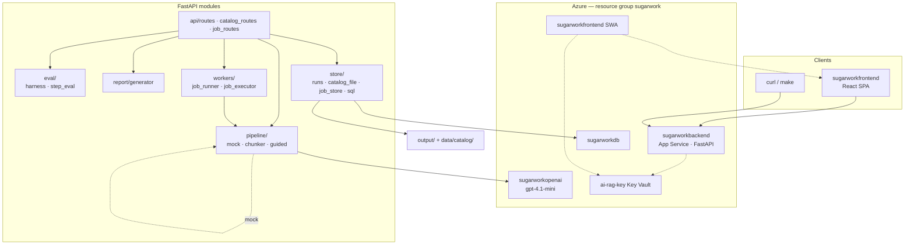
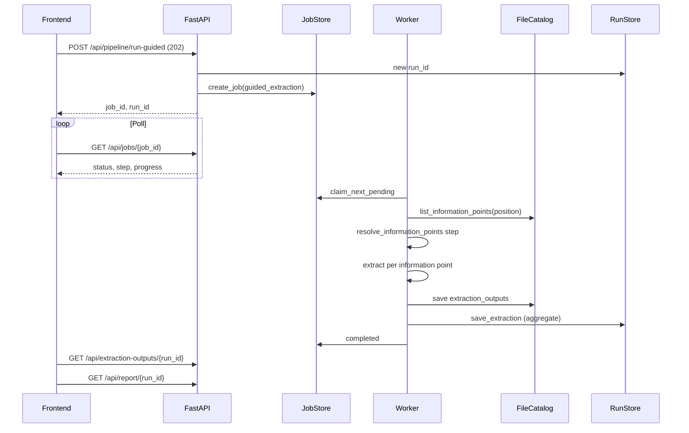
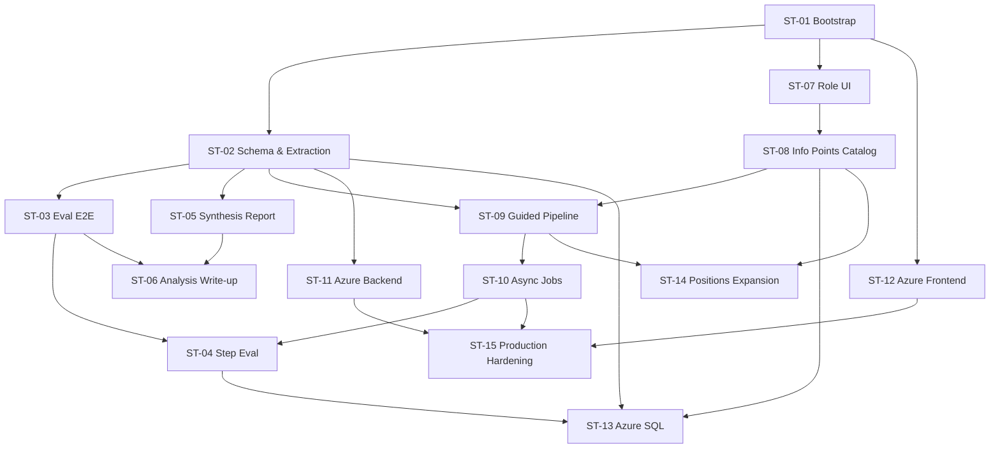

# Sugarwork Knowledge Extraction Pipeline — Project Request

**Version:** 1.0 (2026-06-09)  
**Repos:** `sugarworkbackend` + `sugarworkfrontend` (`v1` branches)  
**Origin:** Eric Chu (CTPO) Sugarwork AI + Data Engineer take-home email + full spec

---

## Vision

Build a **small but production-shaped** version of Sugarwork's core knowledge extraction pipeline: turn an unstructured employee interview transcript into **structured, queryable knowledge** (roles, process steps, decisions, open questions), measure extraction quality with a **runnable eval harness**, and produce a **stakeholder-ready synthesis report** with diagrams.

The system must be demoable in **under 5 minutes** locally (mock mode, no API keys) and deployable to **Azure** for reviewer access. Beyond the take-home minimum, today's build extended the pipeline with **position-based guided extraction**, **async job processing**, **step-level eval**, and an **operator console** with role-based access.

### Take-home four required deliverables

| # | Deliverable | Primary subtasks |
|---|-------------|------------------|
| 1 | **Structured extraction** — transcript → JSON (roles, steps, decisions, open questions) | ST-01, ST-02, ST-09 |
| 2 | **Eval harness** — faithfulness, coverage, structural correctness + failure cases | ST-03, ST-04 |
| 3 | **Synthesis report** — Markdown + Mermaid process diagram from structured data | ST-05 |
| 4 | **Analysis write-up** — failure modes, experiments, fine-tune vs prompt | ST-06 |

---

## Scope

### In scope

- FastAPI backend (`sugarworkbackend`) + React/Vite frontend (`sugarworkfrontend`)
- Mock pipeline (deterministic, no LLM spend) and optional `azure_openai` / `openai` modes
- File-based run store (default) + optional Azure SQL (`sql` / `hybrid`)
- File-based information-points catalog (hybrid: SQL for runs/jobs, files for catalog)
- REST API with CORS, optional `OPS_TOKEN`, `X-User-Id` role header
- Async jobs: `POST` → `202` + `job_id`, poll `GET /api/jobs/{id}`
- Azure deployment: App Service (backend), Static Web App (frontend), Key Vault secrets
- Sample transcript: started as Eric Chu CTPO placeholder; **switched to product_delivery handoff/refund narrative** for guided extraction demo

### Out of scope (for this take-home)

- Fine-tuned models
- Full multi-tenant auth / SSO
- Video ingestion, speech-to-text
- Normalized SQL schema for every entity type (JSON document columns are intentional)
- Private-endpoint-only Azure SQL connectivity (documented limitation)

---

## Success criteria

1. **5-minute local demo:** `make dev` + frontend → run pipeline → eval → report without API keys
2. **Structured JSON** validates against Pydantic `ExtractionResult`; every claim has `evidence[]`
3. **Eval harness** returns `overall_score`, per-metric scores, and `failures[]` with evidence quotes
4. **Report** renders executive summary, RACI, 3 Mermaid diagrams, guided-output table, eval gaps
5. **Guided pipeline** extracts per information-point outputs for a selected `position`
6. **Role UI:** admin CRUD on information points; interviewer read-only
7. **Azure:** backend `/health` returns 200; frontend loads and calls production API
8. **README analysis section** documents failure modes and next experiments (take-home §4)

---

## Tech stack decisions

| Layer | Choice | Rationale (from today's discussion) |
|-------|--------|--------------------------------------|
| API | **FastAPI** + Pydantic v2 | Fast schema validation; structural eval reuses models |
| Frontend | **React 19 + Vite + TypeScript** | Matches existing Sugarwork console patterns |
| LLM | **Azure OpenAI** (`sugarworkopenai`, `gpt-4.1-mini`) | Azure-native; mock mode for CI/demo |
| Persistence | **File store** + optional **Azure SQL** | Hybrid: catalog stays file-based; runs/jobs in SQL when configured |
| Async | **In-process worker** + revival thread | No separate queue service for take-home scope |
| Diagrams | **Mermaid** (server-generated + client render) | Deterministic from JSON, not LLM prose |
| Deploy | **App Service** + **SWA** + **Key Vault** (`ai-rag-key`) | GHA deploy; SWA token from vault at runtime |
| Python packages | **`.python_packages`** target install | Avoid `antenv` exit 127 on App Service |

---

## Architecture overview



### Data flow (guided extraction — today's primary path)



---

## Subtask dependency graph



### Execution waves (parallel-friendly)

| Wave | Subtasks | Notes |
|------|----------|-------|
| 1 | ST-01 | Foundation — unblocks everything |
| 2 | ST-02, ST-07 | Backend core + frontend shell (parallel) |
| 3 | ST-03, ST-05, ST-08 | Eval, report, catalog (parallel after ST-02) |
| 4 | ST-09, ST-06 | Guided pipeline + README analysis |
| 5 | ST-10 | Async jobs — requires guided + eval endpoints |
| 6 | ST-04, ST-13 | Step eval + SQL schema (parallel) |
| 7 | ST-11, ST-12 | Azure deploy (parallel after core APIs) |
| 8 | ST-14 | Expand positions catalog |
| 9 | ST-15 | Health probe, ops token, E2E verification |

---

## Rubric mapping

| Rubric dimension | Evidence in repo | Subtasks |
|------------------|------------------|----------|
| **Pipeline Design** | Mock + LLM modes, chunker, guided per-point extraction, async 202 pattern | ST-02, ST-09, ST-10 |
| **Eval Quality** | `gold_checklist.yaml`, `gold_step_cases.yaml`, failures[], step_score | ST-03, ST-04 |
| **Extraction Quality** | Evidence-linked schema, faithfulness substring check, product_delivery transcript | ST-02, ST-09, ST-14 |
| **Report & Diagram Quality** | 3 Mermaid diagrams, RACI, guided outputs table, eval gap section | ST-05 |
| **Engineering Quality** | CORS, typed API client, Azure CI, startup.sh, hybrid store, role gates | ST-01, ST-07, ST-11–ST-15 |

---

## Repository layout (target state)

```
sugarworkbackend/
  app/api/          routes.py, catalog_routes.py, job_routes.py, deps.py
  app/pipeline/     extractor.py, mock_extractor.py, guided_extractor.py, chunker.py
  app/eval/         harness.py, step_eval.py, gold_checklist.yaml, gold_step_cases.yaml
  app/report/       generator.py
  app/workers/      job_runner.py, job_executor.py
  app/store/        runs.py, catalog_file.py, job_store.py, sql_store.py, hybrid_store.py
  db/               schema.sql, migrate.py, seed_*.sql
  data/             sample_transcript.txt, catalog/*.json
  startup.sh
  .github/workflows/deploy-backend.yml

sugarworkfrontend/
  src/pages/        PipelinePage, ExtractionPage, EvalPage, ReportPage, QuestionEditPage, ...
  src/components/   JobStatusPanel, EvalResults, RunActions
  src/hooks/        useJobPolling.ts
  src/context/      UserContext.tsx
  .github/workflows/azure-static-web-apps-victorious-river-036ce571e.yml
```

---

## Key decisions from today's session

1. **Transcript pivot:** Eric Chu CTPO sample → **product_delivery handoff/refund** narrative for richer guided-extraction demo
2. **Catalog stays file-based** even when SQL is enabled — simpler CRUD, seeds in `data/catalog/`
3. **Eval became async** (`POST /api/eval/run/{id}` → 202) to match guided pipeline pattern
4. **Report enhanced** from partial RACI-only to dynamic summary + process/concept/responsibility diagrams + guided outputs + eval gaps
5. **Azure deploy pitfalls:** never zip Linux venv (`antenv` exit 127); use `.python_packages`; `startup.sh` + gunicorn; health probe blocked when `OPS_TOKEN` gates all routes
6. **Positions dropdown** must include `software_engineer`, `hr`, `product_delivery` with seeded information points per position

---

## References

- Take-home spec: discussed in [today's session](4160234c-59e2-4558-b3f2-4ab84b917754)
- Backend README: `/Users/songxianggu/Project/sugarworkbackend/README.md`
- Frontend README: `/Users/songxianggu/Project/sugarworkfrontend/README.md`
- Production URLs:
  - Backend: `https://sugarworkbackend-hqbubbd7fgakgddr.westus2-01.azurewebsites.net`
  - Frontend: `https://victorious-river-036ce571e.7.azurestaticapps.net`
