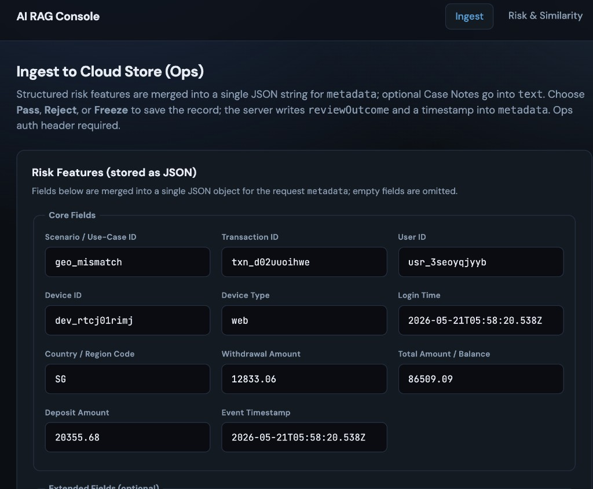
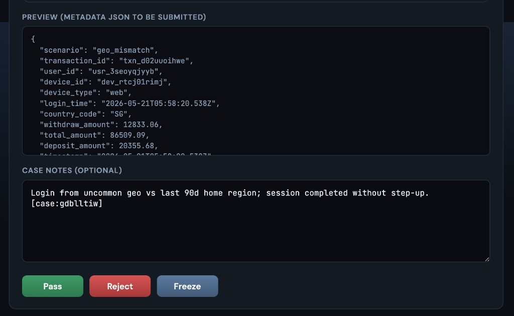
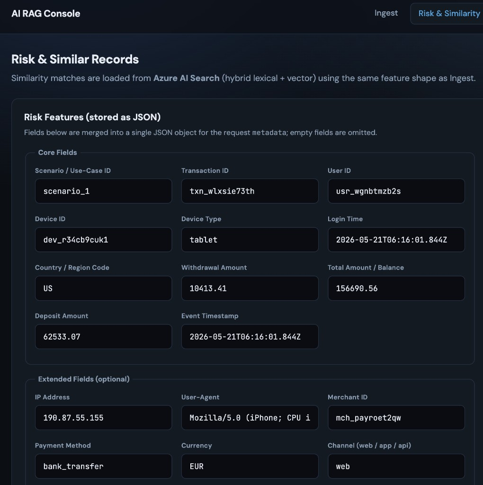
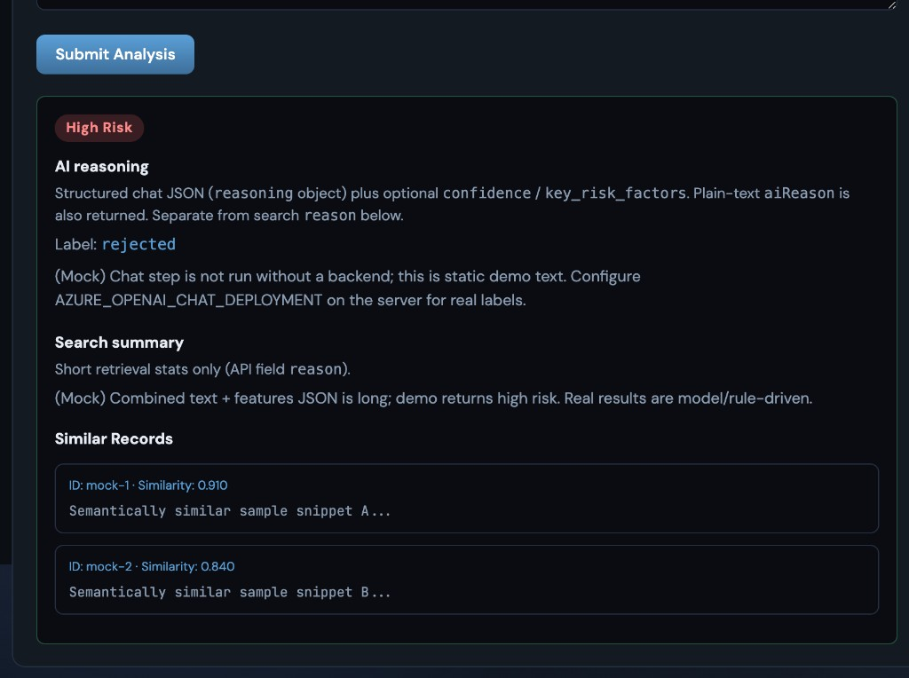

# AI Decision Making — Frontend

Vite + React + TypeScript SPA for **ingesting** labeled risk cases and **assessing** new ones against the backend RAG API. Part of a three-repo platform; see [Related repositories](#related-repositories).

> **Important — all data and table schemas are randomly generated by AI**  
> Across the **AI Decision Making** platform (Backend, this Frontend repo, and ML), **all table schemas** in Azure SQL, **all seeded database rows**, **all API payload fields**, and **all UI feature definitions** (`featureSchema.ts`, `randomFill.ts`, form values you submit to ingest/assess) were **randomly generated by AI**—not real user transactions, production fraud features, or regulated PII. **Every value you see or send in the demo is synthetic.** Do not use for compliance, production decisions, or benchmarking without your own governed schema and data.

## Related repositories

| Repository | Role |
|------------|------|
| [AiDecisionMakingBackend](https://github.com/michaelgsx/AiDecisionMakingBackend) | Spring API, SQL, Search, offline `db/` jobs |
| [AiDecisionMakingML](https://github.com/michaelgsx/AiDecisionMakingML) | Logistic cascade training → Blob |
| **This repo** | Operator UI (Ingest + Assess) |

**Backend design specs:** [AiDecisionMakingBackend/.ai/](https://github.com/michaelgsx/AiDecisionMakingBackend/tree/v1/.ai) (subsystem `07-frontend-spa.md`).

**Branch:** `v1` (deployed to Azure Static Web Apps).

**Live app:** [https://mango-desert-0bc0f121e.7.azurestaticapps.net/](https://mango-desert-0bc0f121e.7.azurestaticapps.net/)

## Screenshots

All values shown below are **randomly AI-generated** demo data (see disclaimer above).

### Ingest (`/`)

Structured risk features merged into metadata JSON, then submitted with Pass / Reject / Freeze.

<p align="center">
  
</p>

<p align="center">
  
</p>

### Assess (`/assess`)

Hybrid search + optional LLM reasoning (mock responses when `VITE_USE_MOCK=true` or chat is disabled on the server).

<p align="center">
  
</p>

<p align="center">
  
</p>

## Features

| Route | Page | API |
|-------|------|-----|
| `/` | **Ingest** — structured risk features + review outcome | `POST /rag/ingest` |
| `/assess` | **Assess** — search summary, similar cases, AI reasoning & evidence | `POST /rag/assess` |

- **RiskFeaturesPanel** — edits core/extended fields aligned with backend `risk_feature_taxonomy`.
- **Random fill** — one-click plausible **random** values for dev (AI-shaped demo data only).
- **Mock mode** — `VITE_USE_MOCK=true` runs without a live API.

## Project structure

```
src/
  pages/
    IngestPage.tsx
    AssessPage.tsx
  components/
    RiskFeaturesPanel.tsx
  risk/
    featureSchema.ts    # Feature keys (keep in sync with backend taxonomy)
    randomFill.ts       # AI-style random demo values
  api/
    client.ts           # ingestRecord(), assessRecord()
  types/
    api.ts              # Mirrors backend AssessResponse / LLM fields
.github/workflows/
  deploy-frontend-swa.yml
staticwebapp.config.json
```

## Quick start

```bash
npm ci
cp .env.example .env   # if present; else create from below
npm run dev
```

Open the dev server (default Vite port, often `5173`).

### Environment variables

| Variable | Required | Description |
|----------|----------|-------------|
| `VITE_API_BASE_URL` | Yes (prod) | Backend root, e.g. `https://ai-rag-webapp.azurewebsites.net` |
| `VITE_OPS_TOKEN` | If API enforces token | Same as backend `OPS_TOKEN` |
| `VITE_USE_MOCK` | No | `true` → skip network calls |

Example local `.env`:

```env
VITE_API_BASE_URL=http://localhost:8787
VITE_OPS_TOKEN=
```

## Build & deploy

```bash
npm run build    # tsc + vite → dist/
```

**CI/CD:** `.github/workflows/deploy-frontend-swa.yml` on push to `v1`.

GitHub secrets (typical): `AZURE_CREDENTIALS`, `VITE_API_BASE_URL`, `VITE_OPS_TOKEN`, Key Vault references per workflow.

SPA routing: `staticwebapp.config.json` fallback to `index.html`.

## API types

`src/types/api.ts` tracks backend DTOs, including assess fields:

- `aiLabel`, `aiReasoning`, `aiEvidence`, `aiConfidence`, `aiKeyRiskFactors`
- `similarRecords`, search `reason` / `risk`

When backend contracts change, update types and pages together; see backend [`.ai/02-assess-rag-api.md`](https://github.com/michaelgsx/AiDecisionMakingBackend/blob/v1/.ai/02-assess-rag-api.md).

## Keeping schema in sync

Feature keys must match:

- Backend: `db/risk_feature_taxonomy.py`
- Frontend: `src/risk/featureSchema.ts`

Both were defined with AI assistance; change them together when adding fields.

## License & use

UI for demonstration only. **All data and table schemas are randomly AI-generated** (see disclaimer above). Do not submit real customer PII unless your deployment is properly governed.
